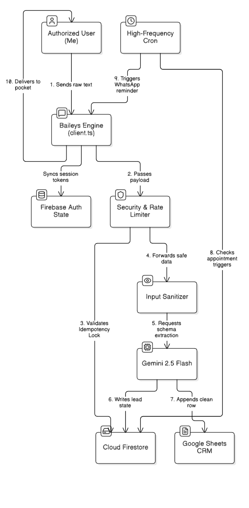
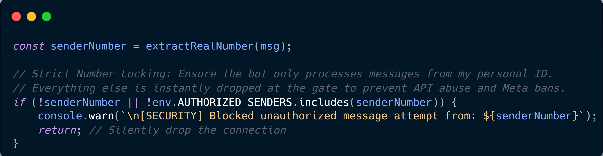
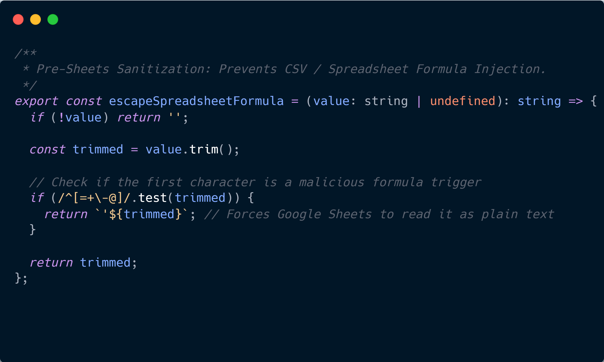
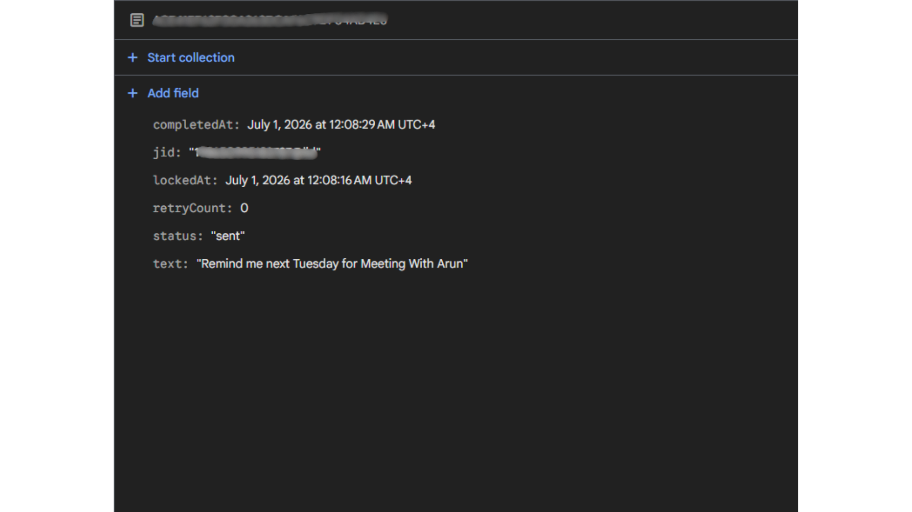
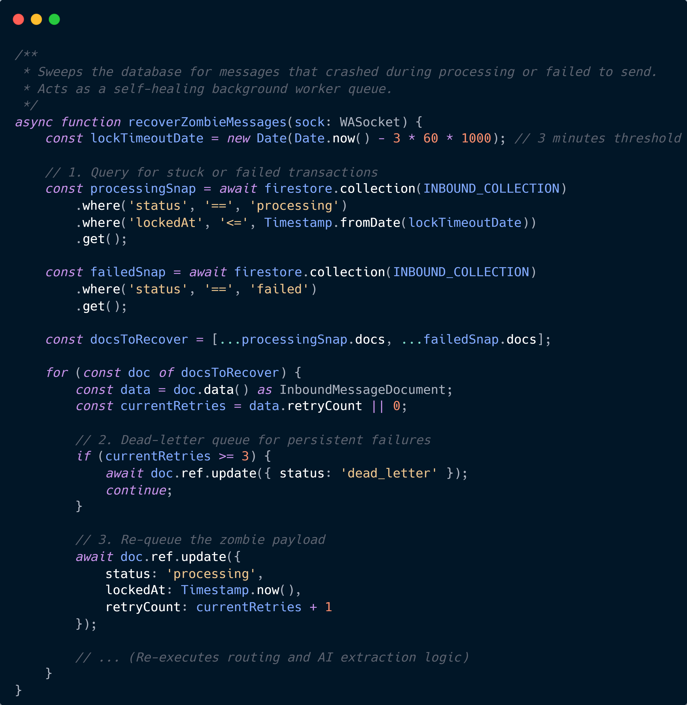

# # Vecta Assistant: Production-Grade WhatsApp AI Sales Companion

An event-driven, production-ready WhatsApp assistant engineered using **Node.js**, **TypeScript**, and **Gemini 2.5 Flash**. This system completely automates the pipeline from capturing unstructured text and images post-client meetings to structured dual-write persistence in Cloud Firestore and Google Sheets CRM, complete with an autonomous background scheduler and enterprise CI/CD auto-rollback deployment.

---

## 🚀 The Core Philosophy

Manual data entry after client meetings is an energy drain. Getting a business card or contact number shouldn't trigger an hour of administrative busywork. 

**Vecta Assistant** allows a professional to bypass data entry entirely. By sending a raw text message, voice note, or simply snapping a photo of a business card directly inside WhatsApp, the underlying system extracts the entity metadata, performs native date-math anchored to the **Asia/Dubai** timezone, secures the data downstream, updates corporate sheets, and establishes automated self-healing follow-up loops.

---

## 🗺️ System Architecture

The assistant operates as a containerized microservice on a dedicated Google Cloud Platform (GCP) Virtual Machine. It decouples state by utilizing Firebase Realtime Database for stateless Baileys authentication handling and local volume mounts for session lock preservation.

  

### End-to-End Data Lifecycle:
1. **Ingestion:** Text and in-memory media image payloads are picked up over a persistent WebSocket connection handled by the **Baileys Engine**.
2. **Security Check:** The `router.ts` engine matches sender data against an authorized whitelist, silently discarding unauthenticated spam.
3. **Idempotency Guarantee:** A Firestore transaction lock checks `msgId` to ensure identical network retries are never processed twice.
4. **Multimodal LLM Extraction:** Gemini 2.5 Flash processes the unstructured string or raw image buffer against strict structural JSON schemas.
5. **Human-in-the-Loop (HITL):** Image OCR extractions are temporarily cached. The system waits for human verification (e.g., replying "Ok") before executing database writes.
6. **Defensive Sanitization:** String fields run through a regex shield to block executable scripts and spreadsheet injection parameters.
7. **Dual-Write State Update:** Verified records are concurrently committed to **Cloud Firestore** and appended to a **Google Sheets CRM**.
8. **Background Cron Processing:** A high-frequency worker sweeps records every 60 seconds, handling event tracking, automated messaging loops, and error-recovery pipelines.

---

## 🛠️ Deep Dive: Core Features & Implementations

### 👁️ 1. Multimodal AI Extraction (Zero-Type Pipeline)
Typing data into a bot is still friction. Vecta eliminates this by processing raw images (business cards, shop storefronts) entirely in memory.

  

* **Implementation (`media.handler.ts` & `gemini.ts`):** When an image is received, it is downloaded directly to an in-memory buffer and piped to the Gemini 2.5 Flash Vision model. The prompt forces a strictly typed JSON return containing `companyName`, `phoneNumber`, and a `confidenceLevel`.
* **Human-in-the-Loop (HITL):** LLM hallucination in automated CRM entry is dangerous. Vecta caches the OCR payload in Firestore and asks the user for confirmation. Only upon a recognized regex approval ("ok", "save") does the system trigger the final persistence pipeline.

### ⚙️ 2. Enterprise DevOps ("Suspend, Swap, & Verify" CI/CD)
Deploying stateful WebSocket applications introduces a massive infrastructure challenge: the Baileys library requires a strict, exclusive lock on WhatsApp authentication files. Standard Blue-Green deployments cause fatal session collisions.

* **Implementation (`deploy.yml`):** Vecta uses a custom GitHub Actions pipeline. On a push to `main`, the pipeline gracefully suspends the active container to cleanly release the SQLite session lock. It then swaps in the newly built container, re-mounting the persistent `auth_session_cache` volume.
* **Automated Rollback & Health Checks:** The pipeline injects a 35-second stabilization window and polls the Docker daemon's `HEALTHCHECK`. If the new Node.js runtime crashes, the system instantly tears down the broken container and revives the cold-storage backup—guaranteeing 24/7 uptime and zero authentication cache corruption.
* **Resource Fencing:** Containers are strictly deployed with `--memory="3.5g"` limits to prevent OOM (Out of Memory) crashes during heavy image buffer processing, and `--log-opt max-size=50m` to prevent VM disk exhaustion.

### 🔒 3. Edge Security & Meta Compliance (`router.ts`)
To protect internal cloud infrastructure and satisfy strict platform access policies, the perimeter is heavily guarded. 

  

* **Implementation:** The incoming string is stripped down to its canonical phone number footprint and verified against a protected runtime array (`AUTHORIZED_SENDERS`). Unauthorized messages are dropped silently at the gate before consuming downstream AI tokens.

### 🧠 4. Contextual Data Extraction (`gemini.ts`)
Turning messy human dialogue into deterministic records requires pairing an LLM with strict response schemas.

  
  

* **Implementation:** Leverages the Gemini SDK with enforced JSON schemas (`responseSchema`). When given phrases like *"Remind me next Tuesday..."*, the system automatically computes future dates anchored to the `Asia/Dubai` timezone and generates crisp, structured database keys, safely parsing missing parameters (like phone numbers) as empty strings to prevent schema validation failures.

### 🛡️ 5. Defensive Data Sanitization (`sanitizer.ts`)
Because data is synchronized directly with external-facing team spreadsheets, the application protects against CSV/Spreadsheet Formula Injection.

  

* **Implementation:** Any payload touching the database is processed by `escapeSpreadsheetFormula`. A regex pattern `/^[=+\-@]/` checks the first byte of incoming values. If an injection signature is discovered, the cell is prepended with a neutralizing single quote (`'`), rendering it as literal plain-text inside Google Sheets.

### 📁 6. Dual-Write State Synchronization
The architecture maintains complete separation of concerns between background worker states and operational user views.

  

* **Cloud Firestore:** Serves as the transactional operational memory, maintaining status keys (`pending`, `processing`, `sent`, `failed`), retry indexes, and locking metrics.
* **Google Sheets CRM:** Functions as a human-readable ledger immediately accessible by internal office employees and field personnel without grant-level database access.

### 🔄 7. Self-Healing Background Scheduler (`reminderCron.ts`)
Real-world systems face unexpected processing lockups, network splits, and API timeouts. Vecta uses a fault-tolerant state-machine architecture.

  

* **Implementation:** The background engine scans for items with a state of `processing` that exceed a 3-minute lock window, alongside explicit `failed` transactions. If the transaction has failed permanently (`retryCount >= 3`), it drops into a **Dead-Letter Queue (DLQ)** for manual auditing. Otherwise, it increments the retry value and transparently re-injects the message into the parsing queue.

---

## 📦 Technology Stack & Environment

* **Runtime:** Node.js (v20+) with TypeScript
* **WhatsApp Gateway:** Baileys Core (WebSocket Layer)
* **AI Processing Engine:** Gemini 2.5 Flash API (Multimodal OCR & Text Parsing)
* **Databases:** Google Cloud Firestore & Firebase Realtime DB
* **Business Interface:** Google Sheets Enterprise API
* **Infrastructure Host:** Google Cloud Platform (Compute Engine `e2-medium`)
* **DevOps / CI/CD:** GitHub Actions, Docker, Google Artifact Registry
